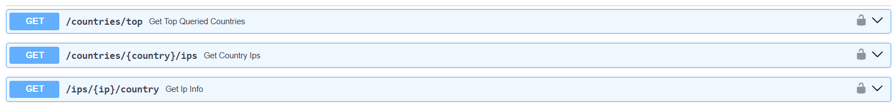
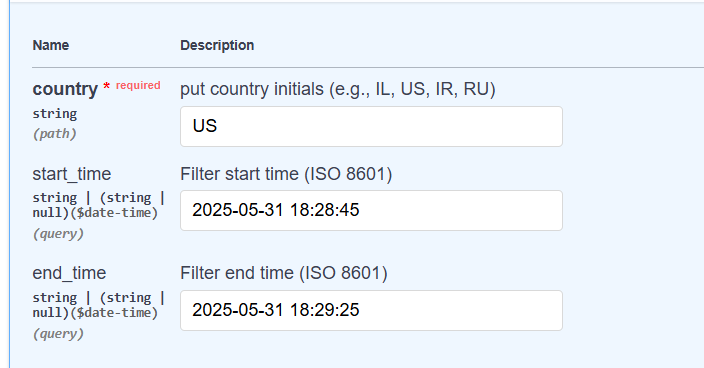

## Geo ip webserver

Get country of given ip. You can also get info about queried ips.

> Note that countries are represented as country code to simplify it.

## How to Query

First you have to register, route to `/users/register` and pass username and password.

To log in easily use the authorized button and pass your user and password.  

Now you can use these routes to gain info.

#### route `/coutries/top`.

Get top queried countries. This will tell you what the x most queried ips from all countries are.

#### Route `/countries/{country}/ips`

Get queried ips from this country code, you can also ask for ips between datetimes.

For example:

#### Route `ips/{ip}/country`

Get the country of the provided ip. 

